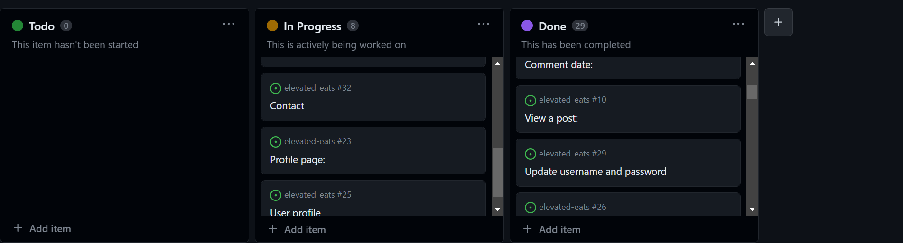
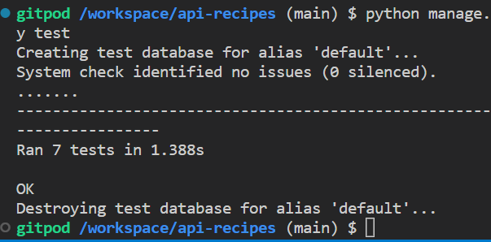

# Elevated Eats API

* This is the backend service used by the [Elevated Eats Application](https://github.com/MollyAdamsson/elevated-eats)

## Development Goals

* The main goal for this API is to provide a good backend service that supports the Elevated Eats front end and makes sure it performs accordingly.

## Project Planning

This project was created via agile methods during two weeks.
I used the Kanban board to easily organize my work, you can find this via the github projects [here](https://github.com/users/MollyAdamsson/projects/7/views/1). The developer creates cards to help them during the development, this is mainly to make it easier to keep track of the different user stories and make sure everything is completed.



## Epics

### Set up

Takes care of the API endpoint creation and the connection to the CRUD functions.

### Posts

Takes care of the API endpoint creation and the connection to the CRUD functions when users create a post.

### Comments

Takes care of the API endpoint creation and the connection to the CRUD functions when a user comments on a post.

### Profiles

Takes care of the API endpoint creation and the connection to the CRUD functions when a user creates their prfoiles, it also includes the following/unfollowing functions.

### Ratings

Takes care of the API endpoint creation and the connection to the CRUD functions when a user rates a post. 

### Reviews

Takes care of the API endpoint creation and the connection to the CRUD functions of profile reviews made by other users. 

# User Stories

## Set up
* As a developer, I need to set up the base of the project to make sure I can expand the features I want to apply.
* As a developer, I need to connect the project to a Cloudinary account so that my images renders the way I want.
* As a user, I can create an account and am able to access all of the options created. 

## Posts
* As a user I want to be able to create a post/recipe 
* As a user I want to be able to edit and delete a post/recipe

## Comments
* As a user I want to be able to comment on a post/recipe and delete/edit if I want to 

## Profiles
* As a developer I want to create a blank profile with a default image that the user can chnage as per their own liking.
* As a user I want to be able to view other profiles as a list

## Ratings
* As a user I want to be able to review a post/recipe.

## Reviews
* As a user I want to be able to leave a review on another users profile.

# Security

* The permission class that handles who gets to delete and edit the content based on owner was added, its called IsOwnerOrReadOnly. 

## Endpoints

User Story:

`As a developer, I need to create the base project set up so that I can build out the features.`

Implementation:

The base project was created with all of the neccessary packages installed and frozen into the requirements.

The settings were also edited to hide any secret variables and set dev and production environments apart.

User Story:

`As a user I can create a new account so that I can access all the features for signed up users`

Implementation:

Django rest framework and dj_rest_auth were installed and added to the url patterns and site packages to make use of their built in authentication system. Only registered users can create posts/recipes + like and comment on other users recipes.

User Story:

`As a user, I want to be able to view edit or delete a post`

`As a user, I want to able to create a post and list posts`

Implementation:

Endpoint: /posts/

Methods:
* POST - Used to create post
* GET - Used to get a list of posts

Endpoint: /posts/<int:pk>/

Methods:
* GET - Get a single post
* PUT - Used to update a single post
* DELETE - Used to delete a post

User Story:

`As a developer, I want to create a new blank profile with default image when a user is created.`

Implementation:

In the profiles app, a signal was created in order to create a new user profile on signup.

User Story:

`As a user, I want to able to get a list of profiles`

Implementation:

Endpoint: /profiles/

Methods:
* POST - Used to create post
* GET - Used to get a list of posts

Endpoint: /profiles/<int:pk>/

Methods:
* GET - Get a single profile
* PUT - Used to update a single profile
* DELETE - Used to delete a profile

User Story: 

`As a developer, I want to create rating model and API view so that users can rate eachothers posts`

Implementation:

In the ratings app i made sure that the backend handled the ratings_count and ratings by users so that it was up to correct info regarding what post/recipe was rated.


`As a developer, I want to create a review model and API view so that users can review eachothers profiles`

In the review app I connected the profile and profilereview apps so that every time someone leaves a review on a profile the profilereview count collects the correct data.

# Technologies
* Django
    * Main framework used for application creation
* Django REST Framework
    * Framework used for creating API
* Cloudinary
    * Used for static image hosting
* Heroku
    * Used for hosting the application
* Git
    * Used for version control
* Github
    * Repository for storing code base and docs

# Python Packages
<details open>
<summary> Details of packages </summary>

* dj-database-url==1.0.0
    * Used to parse the DATABASE_URL connection settings
* dj-rest-auth==2.2.5
    * Used with auth system
* Django==4.1.1
    * Main framework used to start the project
* django-allauth==0.50.0
    * Used for authentication
* django-cors-headers==3.13.0
    * Used for Cross-Origin Resource Sharing (CORS) headers to responses
* django-filter==22.1
    * Used to filter API results in serializers
* django-storages==1.13.1
    * Used to help connect with the google cloud storage bucket
* djangorestframework==3.13.1
    * Framework used to build the API endpoints
* djangorestframework-simplejwt==5.2.0
    * Used with djange rest framework to create access tokens for authentication
* gunicorn==20.1.0
    * Used for deployment of WSGI applications
* Pillow==9.2.0
    * Imaging Libray - used for image uploading
* psycopg2==2.9.3
    * PostgreSQL database adapter to allow deployed application to perform crud on the postgresql db
* PyJWT==2.5.0
    * For creating the Python Json Web Tokens for authentication

Installed as package dependcies with above installations:

* asgiref==3.6.0
* cloudinary==1.32.0
* dj-database-url==0.5.0
* dj-rest-auth==2.1.9
* Django==3.2.18
* django-allauth==0.44.0
* django-cloudinary-storage==0.3.0
* django-cors-headers==3.14.0
* django-filter==23.1
* djangorestframework==3.14.0
* djangorestframework-simplejwt==5.2.2
* gunicorn==20.1.0
* oauthlib==3.2.2
* Pillow==9.5.0
* psycopg2==2.9.6
* PyJWT==2.6.0
* python3-openid==3.2.0
* pytz==2023.3
* requests-oauthlib==1.3.1
* sqlparse==0.4.3

# Testing

Unit tests in posts app:



The API's were tested locally during development but the core testing was done as part of the front end repos and testing to the real API's manually via form inputs and page loads. The results can be found [here](https://github.com/MollyAdamsson/elevated-eats/blob/main/TESTING.md)

## Deployment

### Creation

This project was created using Gitpod and then pushed to Github.
To ensure this the user must type:

```git add .``` 

```git commit -m “commit message”```  

```git push``` 

This will make sure all of the files are added, commented on and then pushed to the repository for storage.

### [Elephantsql](https://www.elephantsql.com/) 

* Heroku needs sql's to work
* ElephantSQL will manage administrative tasks of PostgreSQL, such as installation, upgrades to latest stable version and backup handling.
* It automates every part of setup and running of PostgreSQL clusters.

1. Log into Heroku 
The first step to creating a free PostgreSQL database is to log in to Heroku. To create a new database on Heroku, an app must first be created within the personal dashboard. 

2. Create a new Heroku app 
Once logged in to Heroku, navigate to the personal app dashboard to create a new Heroku app. Simply click the Create new app button, which should be located on the top-right corner of the dashboard. 

3. Add a PostgreSQL database 
After creating the new app, it's time to attach a PostgreSQL database to it. Simply navigate to the Resources tab located in the header of the app's dashboard. Add the ElephantSql and a free PostgreSQL database has now been successfully created. 

### [Github](https://github.com/) 

* When logging into github, navigate to the settings tab
* Here you can find pages down on the left side
* A new page will load which will present the branch to master or main, and then the save option
* Once the save button has been clicked and the page is reloaded there will be a link to the deployed site.

### [Heroku](https://www.heroku.com/) Deployment:

* Ensure your requirements.txt file has the required dependencies. To do this you can use the following
code in your IDE: pip3 freeze > requirements.txt
* Create or login to you Heroku account
* Navigate to Dashboard
* Click and select "Create app" in the middle of the page
* Enter a unique name for you app
* Select region and the "create app"

### App deployment
* Navgiate to the deploy section
* Scroll down to the "deployment method" and select "Github"
* Authorise the connection
* Also important to make sure you have the right config variables applied, these change the way the app behaves. 
* Go to the settings tab and then click reveal config vars
* Make sure you have the correct config cars
* Go to deploy tab
* Search for the repository name you've chosen
* Make sure you have selected the correct branch (master/main), and select the method you desire.

## Cloudinary storage

* I used Cloudinary to store my images 

## Credits

* I used the Code Institute's videos for 'Django Rest Framework' (walkthrough project) as guidance whilst setting the base up. 

### Acknowledgements
* This Recipe Blog was created as Portfolio Project 5 for the the Full Stack Software Developer diploma by the [Code Institute](https://codeinstitute.net/). 

* I would like to thank my mentor [Gareth McGirr](https://www.linkedin.com/in/gareth-mcgirr/) for helping me and guiding me through this project, the tutors at code institute for being extremely helpful considering my many questions and to my partner who helped me with mental support.


Molly Adamsson, 2023


